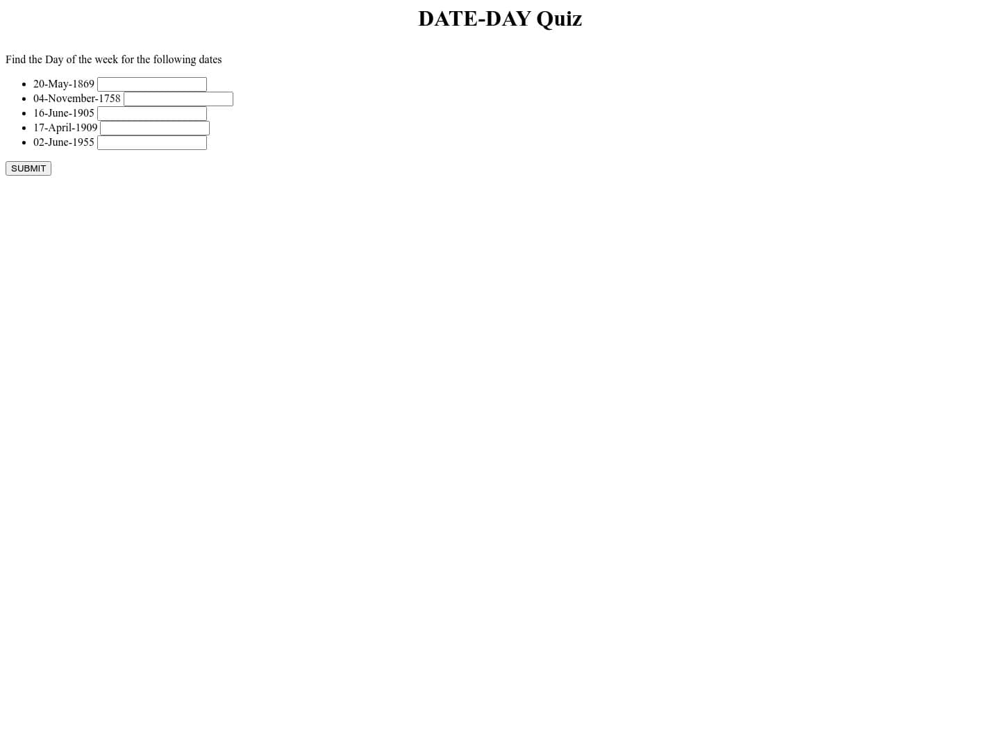
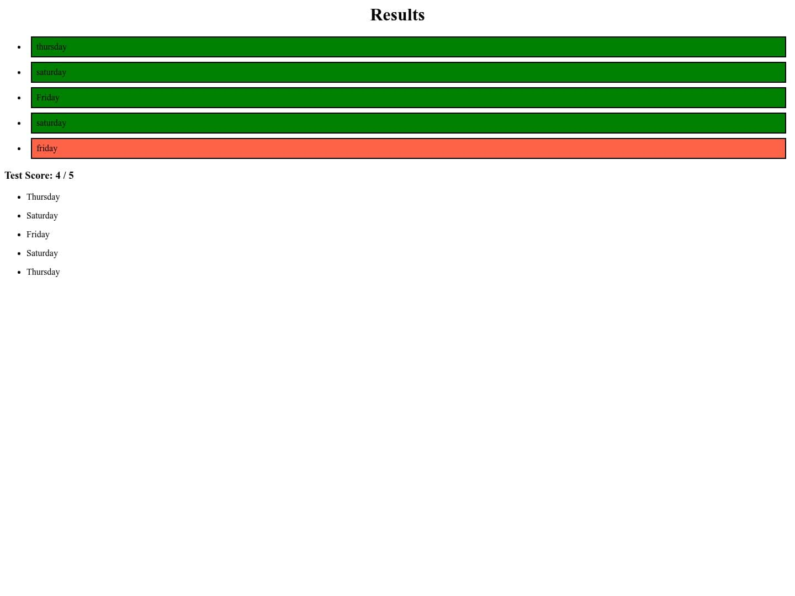

# date-quizzer

## Table of Contents 
  * [Description](#description)
  * [Functionality](#functionality)
  * [Technology](#technology)
  * [Setup](#setup)
  * [Requirements](#requirements)
  * [Pictures](#pictures)

### Description 
*Simple nodejs application that implements the John Horton Conway's idea of an application prompting dates for whom the user must enter the right day of the week. This application also stores the question-answer pair for every answer quiz that the user takes.*

### 

### Functionality 
* 1) Dynamic HTML generation for tests (using EJS)
* 2) Random Date generation (python) 
* 3) Autocorrect the responses (JS logic)
* 4) Save the data in a local folder 
* 5) HOST the test on a local-server (Express applicaation)

### Technology 
* 1) Express
* 2) EJS
* 3) HTML
* 4) Python

### Setup 
  #### Windows
  1) A simple .bat file can be created to run the project on click. A text file must follow the given below format 
  `
  {pythonPath} "absolute/path/to/main.py" 
  and be converted to .bat file.
  `
  
  2) You can simply run the file to open an application in a browser at address http://localhost:4000/index.
  3) Additionally - task scheduler in Windows can be used to run this .bat file at required intervals.

  ### Linux 
  1) Similar to Windows a .sh file can be created and run. 

### Requirements 
* 1) Python must be available in the command line
* 2) Node must be install (npm comes with node)
* 3) Local Host 4000 must be free for the functioning 

### Pictures 
<ul>
 <li>
  
Questions Page (index.html)

   </img>
 </li>
 
 <li>
 
Answers Page (answers.html)

  </img>
 </li>
</ul>

### Sources
1) Finding the day of the week. (https://web.archive.org/web/20061018103244/http://www.cs.wustl.edu/~ksl2/mathpoem.html)
2) Archive on "How to calculate the day of the week mentally". (https://web.archive.org/web/20070115153606/http://www.theworldofstuff.com/other/day.html)
